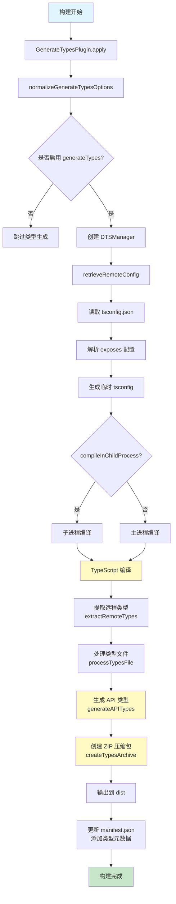
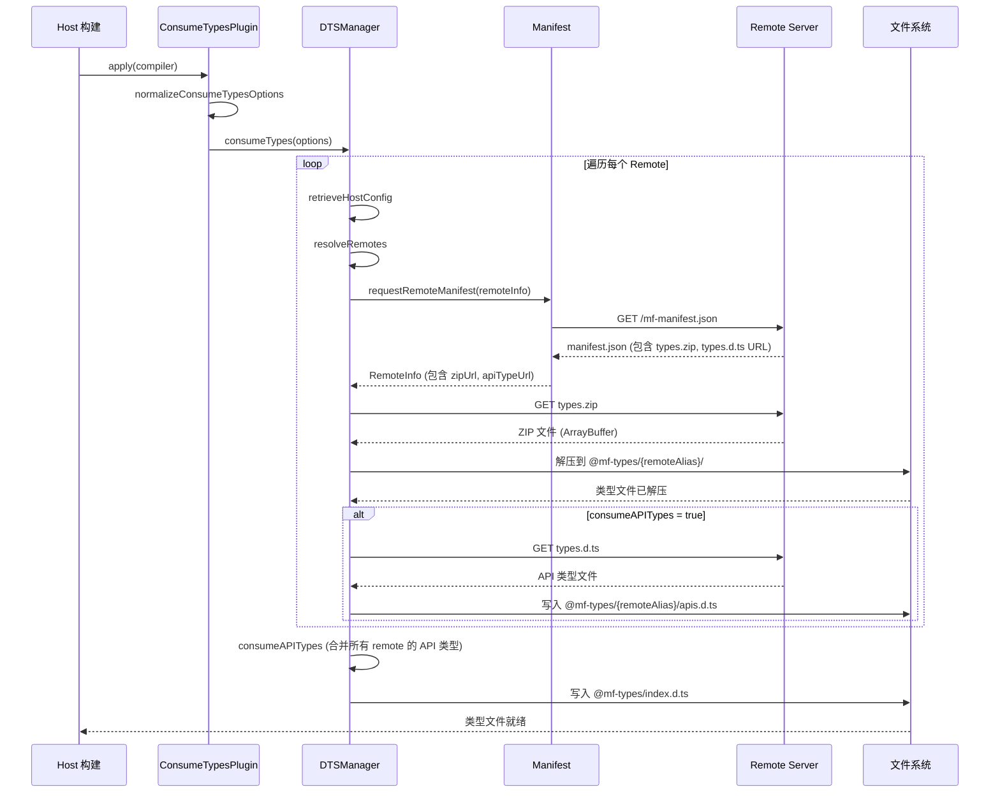
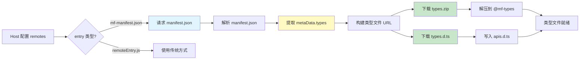
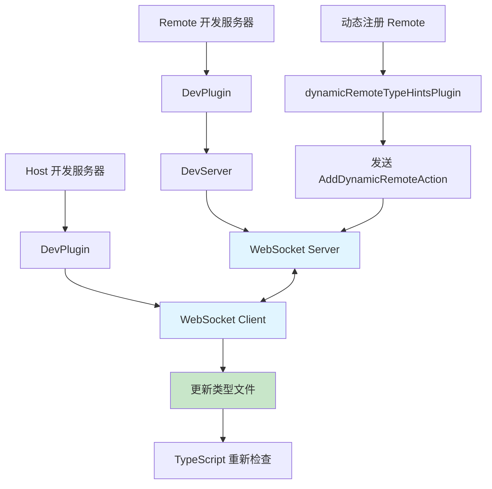
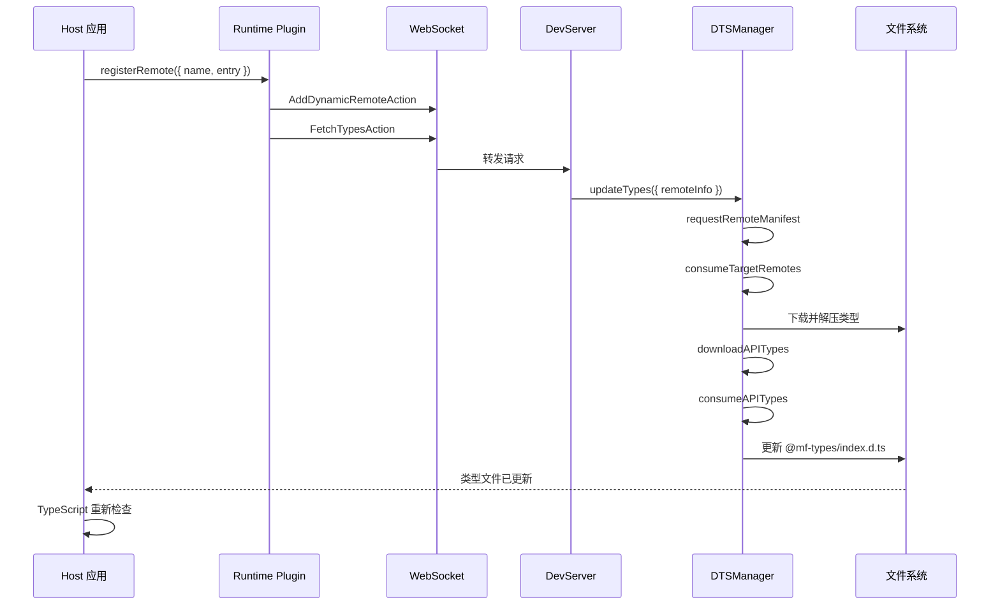
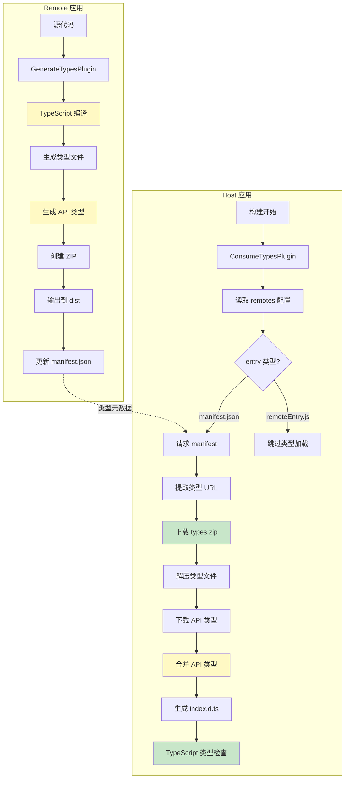
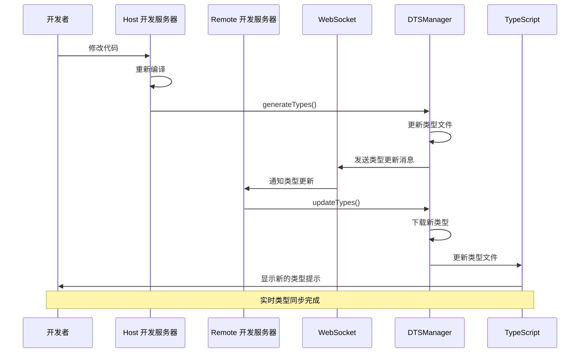

# Module Federation 远程模块类型加载机制深度分析

## 目录

1. [概述](#概述)
2. [架构设计](#架构设计)
3. [类型生成流程（Remote端）](#类型生成流程remote端)
4. [类型消费流程（Host端）](#类型消费流程host端)
5. [Manifest集成机制](#manifest集成机制)
6. [动态类型提示](#动态类型提示)
7. [关键代码分析](#关键代码分析)
8. [完整流程图](#完整流程图)

---

## 概述

Module Federation 通过 `@module-federation/dts-plugin` 实现了完整的 TypeScript 类型支持，使得在 Host 应用中能够获得 Remote 模块的完整类型提示和类型检查。该机制支持两种模式：

1. **静态类型加载**：在构建时从 manifest.json 获取类型信息并下载
2. **动态类型提示**：在开发时通过 WebSocket 实时同步类型更新

### 核心特性

- ✅ 自动生成和消费远程模块类型
- ✅ 支持通过 manifest.json 获取类型元数据
- ✅ 类型文件压缩和下载
- ✅ API 类型生成（用于 `loadRemote` 函数类型推断）
- ✅ 开发时实时类型同步
- ✅ 支持动态远程模块类型加载

---

## 架构设计

### 核心组件

```
┌─────────────────────────────────────────────────────────────┐
│                    Module Federation 类型系统                 │
├─────────────────────────────────────────────────────────────┤
│                                                               │
│  ┌──────────────────┐         ┌──────────────────┐          │
│  │  Remote 端       │         │  Host 端         │          │
│  │                  │         │                  │          │
│  │ GenerateTypes   │         │ ConsumeTypes     │          │
│  │ Plugin           │         │ Plugin           │          │
│  │                  │         │                  │          │
│  │ - 编译类型文件    │         │ - 下载类型文件    │          │
│  │ - 生成 ZIP       │         │ - 解压类型文件    │          │
│  │ - 生成 API 类型   │         │ - 合并 API 类型   │          │
│  └──────────────────┘         └──────────────────┘          │
│                                                               │
│  ┌──────────────────────────────────────────────────┐        │
│  │           DTSManager (核心管理器)                 │        │
│  │  - generateTypes()                                │        │
│  │  - consumeTypes()                                 │        │
│  │  - updateTypes()                                  │        │
│  └──────────────────────────────────────────────────┘        │
│                                                               │
│  ┌──────────────────────────────────────────────────┐        │
│  │           Manifest 集成                           │        │
│  │  - 类型元数据 (types.zip, types.d.ts)             │        │
│  │  - 从 manifest.json 获取类型 URL                  │        │
│  └──────────────────────────────────────────────────┘        │
│                                                               │
│  ┌──────────────────────────────────────────────────┐        │
│  │           动态类型提示 (开发模式)                  │        │
│  │  - WebSocket 通信                                 │        │
│  │  - 实时类型更新                                    │        │
│  └──────────────────────────────────────────────────┘        │
└─────────────────────────────────────────────────────────────┘
```

### 关键目录结构

```
host/
├── @mf-types/                    # 类型文件目录
│   ├── index.d.ts               # 主类型入口（合并所有 remote 的 API 类型）
│   ├── remote1/
│   │   ├── apis.d.ts            # remote1 的 API 类型定义
│   │   ├── button.d.ts          # 导出文件
│   │   └── compiled-types/      # 编译后的类型文件
│   │       └── button.d.ts
│   └── remote2/
│       ├── apis.d.ts
│       ├── button.d.ts
│       └── compiled-types/
│           └── button.d.ts
└── tsconfig.json                 # 配置路径映射
    └── paths: { "*": ["./@mf-types/*"] }
```

---

## 类型生成流程（Remote端）

Remote 应用在构建时生成类型文件，供 Host 应用消费。

### 流程图



### 详细步骤

#### 1. 插件初始化

**文件**: `core/packages/dts-plugin/src/plugins/GenerateTypesPlugin.ts`

```typescript
export class GenerateTypesPlugin implements WebpackPluginInstance {
  apply(compiler: Compiler) {
    const dtsManagerOptions = normalizeGenerateTypesOptions({
      context,
      outputDir,
      dtsOptions,
      pluginOptions,
    });
    
    compiler.hooks.thisCompilation.tap('mf:generateTypes', (compilation) => {
      compilation.hooks.processAssets.tapPromise(
        { stage: PROCESS_ASSETS_STAGE_OPTIMIZE_TRANSFER },
        async () => {
          await generateTypesAPI({ dtsManagerOptions });
        }
      );
    });
  }
}
```

#### 2. 配置解析

**文件**: `core/packages/dts-plugin/src/core/configurations/remotePlugin.ts`

- 读取 `tsconfig.json`
- 解析 `exposes` 配置，生成 `mapComponentsToExpose`
- 创建临时 tsconfig，配置编译选项

#### 3. TypeScript 编译

**文件**: `core/packages/dts-plugin/src/core/lib/typeScriptCompiler.ts`

```typescript
export const compileTs = async (
  mapComponentsToExpose: Record<string, string>,
  tsConfig: TsConfigJson,
  remoteOptions: Required<RemoteOptions>,
) => {
  // 1. 创建临时 tsconfig
  const tempTsConfigJsonPath = writeTempTsConfig(tsConfig, ...);
  
  // 2. 执行 TypeScript 编译
  const execPromise = util.promisify(exec);
  await execPromise(`tsc -p ${tempTsConfigJsonPath}`);
  
  // 3. 处理编译后的类型文件
  await processTypesFile({ ... });
};
```

#### 4. API 类型生成

**文件**: `core/packages/dts-plugin/src/core/lib/DTSManager.ts`

```typescript
generateAPITypes(mapComponentsToExpose: Record<string, string>) {
  // 生成 RemoteKeys 联合类型
  const exposePathKeys = [...exposePaths].join(' | ');
  
  // 生成条件类型 PackageType
  const packageType = Object.keys(mapComponentsToExpose).reduce(
    (sum, exposeKey) => {
      const curType = `T extends '${exposePath}' ? typeof import('${exposePath}') :`;
      return curType + sum;
    },
    'any;',
  );
  
  return `
    export type RemoteKeys = ${exposePathKeys};
    type PackageType<T> = ${packageType}`;
}
```

**生成示例** (`remote2/apis.d.ts`):
```typescript
export type RemoteKeys = 'remote2/button';
type PackageType<T> = T extends 'remote2/button' ? typeof import('remote2/button') : any;
```

#### 5. 创建 ZIP 压缩包

**文件**: `core/packages/dts-plugin/src/core/lib/archiveHandler.ts`

```typescript
export const createTypesArchive = async (
  tsConfig: TsConfigJson,
  remoteOptions: Required<RemoteOptions>,
) => {
  const mfTypesPath = retrieveMfTypesPath(tsConfig, remoteOptions);
  const zip = new AdmZip();
  zip.addLocalFolder(mfTypesPath);
  return zip.writeZipPromise(retrieveTypesZipPath(mfTypesPath, remoteOptions));
};
```

#### 6. Manifest 元数据更新

**文件**: `core/packages/manifest/src/utils.ts`

```typescript
export function getTypesMetaInfo(
  pluginOptions: moduleFederationPlugin.ModuleFederationPluginOptions,
  context: string,
): MetaDataTypes {
  const { apiFileName, zipName } = retrieveTypesAssetsInfo({
    ...normalizedRemote,
    context,
    moduleFederationConfig: pluginOptions,
  });
  
  return {
    path: '',
    name: '',
    zip: zipName,      // 例如: @mf-types.zip
    api: apiFileName,  // 例如: @mf-types.d.ts
  };
}
```

Manifest 中的类型元数据：
```json
{
  "metaData": {
    "types": {
      "zip": "@mf-types.zip",
      "api": "@mf-types.d.ts"
    }
  }
}
```

---

## 类型消费流程（Host端）

Host 应用在构建时或开发时从 Remote 应用获取类型文件。

### 流程图



### 详细步骤

#### 1. 插件初始化

**文件**: `core/packages/dts-plugin/src/plugins/ConsumeTypesPlugin.ts`

```typescript
export class ConsumeTypesPlugin implements WebpackPluginInstance {
  apply(compiler: Compiler) {
    const dtsManagerOptions = normalizeConsumeTypesOptions({
      context: compiler.context,
      dtsOptions,
      pluginOptions,
    });
    
    const promise = consumeTypesAPI(dtsManagerOptions, fetchRemoteTypeUrlsResolve);
    
    compiler.hooks.thisCompilation.tap('mf:generateTypes', (compilation) => {
      compilation.hooks.processAssets.tapPromise(
        { stage: PROCESS_ASSETS_STAGE_OPTIMIZE_TRANSFER - 1 },
        async () => {
          await promise; // 等待类型下载完成
        }
      );
    });
  }
}
```

#### 2. 从 Manifest 获取类型 URL

**文件**: `core/packages/dts-plugin/src/core/lib/DTSManager.ts`

```typescript
async requestRemoteManifest(
  remoteInfo: RemoteInfo,
  hostOptions: Required<HostOptions>,
): Promise<Required<RemoteInfo>> {
  // 1. 检查是否为 manifest 入口
  if (!remoteInfo.url.includes(MANIFEST_EXT)) {
    return remoteInfo as Required<RemoteInfo>;
  }
  
  // 2. 请求 manifest.json
  const url = remoteInfo.url;
  const res = await axiosGet(url, {
    timeout: hostOptions.timeout,
    family: hostOptions.family,
  });
  const manifestJson = res.data as Manifest;
  
  // 3. 提取类型元数据
  if (!manifestJson.metaData.types.zip) {
    throw new Error(`Can not get ${remoteInfo.name}'s types archive url!`);
  }
  
  // 4. 构建完整的类型文件 URL
  const publicPath = inferAutoPublicPath(remoteInfo.url);
  remoteInfo.zipUrl = new URL(
    path.join(publicPath, manifestJson.metaData.types.zip),
  ).href;
  remoteInfo.apiTypeUrl = new URL(
    path.join(publicPath, manifestJson.metaData.types.api),
  ).href;
  
  return remoteInfo as Required<RemoteInfo>;
}
```

#### 3. 下载和解压类型文件

**文件**: `core/packages/dts-plugin/src/core/lib/archiveHandler.ts`

```typescript
export const downloadTypesArchive = (hostOptions: Required<HostOptions>) => {
  return async ([destinationFolder, fileToDownload]: string[]) => {
    const destinationPath = retrieveTypesArchiveDestinationPath(
      hostOptions,
      destinationFolder,
    );
    
    // 1. 下载 ZIP 文件
    const response = await axiosGet(fileToDownload, {
      responseType: 'arraybuffer',
      timeout: hostOptions.timeout,
      family: hostOptions.family,
    });
    
    // 2. 解压 ZIP 文件
    const zip = new AdmZip(Buffer.from(response.data));
    zip.extractAllTo(destinationPath, true);
    
    return [destinationFolder, destinationPath];
  };
};
```

#### 4. 下载 API 类型文件

**文件**: `core/packages/dts-plugin/src/core/lib/DTSManager.ts`

```typescript
async downloadAPITypes(
  remoteInfo: Required<RemoteInfo>,
  destinationPath: string,
  hostOptions: Required<HostOptions>,
) {
  const { apiTypeUrl } = remoteInfo;
  if (!apiTypeUrl) {
    return;
  }
  
  // 1. 下载 API 类型文件
  const res = await axiosGet(apiTypeUrl, {
    timeout: hostOptions.timeout,
    family: hostOptions.family,
  });
  
  // 2. 替换占位符为实际的 remote alias
  let apiTypeFile = res.data as string;
  apiTypeFile = apiTypeFile.replaceAll(
    REMOTE_ALIAS_IDENTIFIER,  // '@mf-remote-alias'
    remoteInfo.alias,          // 'remote2'
  );
  
  // 3. 写入文件
  const filePath = path.join(destinationPath, REMOTE_API_TYPES_FILE_NAME);
  fs.writeFileSync(filePath, apiTypeFile);
}
```

#### 5. 合并 API 类型

**文件**: `core/packages/dts-plugin/src/core/lib/DTSManager.ts`

```typescript
consumeAPITypes(hostOptions: Required<HostOptions>) {
  // 1. 收集所有已加载的 remote API 类型
  const importTypeStr = [...this.loadedRemoteAPIAlias]
    .sort()
    .map((alias, index) => {
      const remoteKey = `RemoteKeys_${index}`;
      const packageType = `PackageType_${index}`;
      return `import type { PackageType as ${packageType}, RemoteKeys as ${remoteKey} } from './${alias}/apis.d.ts';`;
    })
    .join('\n');
  
  // 2. 生成合并后的类型定义
  const remoteKeysStr = `type RemoteKeys = ${remoteKeys.join(' | ')};`;
  const packageTypesStr = `type PackageType<T, Y=any> = ${[...packageTypes, 'Y'].join(' :\n')};`;
  
  // 3. 为每个 runtime 包生成类型声明
  const pkgsDeclareStr = [...runtimePkgs]
    .map((pkg) => {
      return `declare module "${pkg}" {
        ${remoteKeysStr}
        ${packageTypesStr}
        export function loadRemote<T extends RemoteKeys, Y>(packageName: T): Promise<PackageType<T, Y>>;
        export function loadRemote<T extends string, Y>(packageName: T): Promise<PackageType<T, Y>>;
      }`;
    })
    .join('\n');
  
  // 4. 写入主类型文件
  const fileStr = `${importTypeStr}\n${pkgsDeclareStr}`;
  fs.writeFileSync(
    path.join(hostOptions.context, hostOptions.typesFolder, HOST_API_TYPES_FILE_NAME),
    fileStr,
  );
}
```

**生成的 `@mf-types/index.d.ts` 示例**:
```typescript
import type { PackageType as PackageType_0, RemoteKeys as RemoteKeys_0 } from './remote1/apis.d.ts';
import type { PackageType as PackageType_1, RemoteKeys as RemoteKeys_1 } from './remote2/apis.d.ts';

declare module "@module-federation/runtime" {
  type RemoteKeys = RemoteKeys_0 | RemoteKeys_1;
  type PackageType<T, Y=any> = T extends RemoteKeys_0 ? PackageType_0<T> :
T extends RemoteKeys_1 ? PackageType_1<T> :
Y ;
  export function loadRemote<T extends RemoteKeys, Y>(packageName: T): Promise<PackageType<T, Y>>;
  export function loadRemote<T extends string, Y>(packageName: T): Promise<PackageType<T, Y>>;
}

declare module "@module-federation/enhanced/runtime" {
  // 相同的类型定义...
}
```

---

## Manifest集成机制

Module Federation 通过 manifest.json 提供类型元数据，实现类型文件的自动发现和下载。

### Manifest 结构

```json
{
  "id": "remote2",
  "publicPath": "http://localhost:3002/",
  "exposes": {
    "./button": {
      "assets": {
        "js": ["button.js"]
      }
    }
  },
  "metaData": {
    "types": {
      "zip": "@mf-types.zip",
      "api": "@mf-types.d.ts"
    },
    "publicPath": "http://localhost:3002/"
  }
}
```

### 类型元数据获取流程



### 代码实现

**文件**: `core/packages/manifest/src/utils.ts`

```typescript
export function getTypesMetaInfo(
  pluginOptions: moduleFederationPlugin.ModuleFederationPluginOptions,
  context: string,
): MetaDataTypes {
  const normalizedDtsOptions = normalizeOptions<PluginDtsOptions>(
    isTSProject(pluginOptions.dts, context),
    {
      generateTypes: defaultRemoteOptions,
      consumeTypes: {},
    },
    'mfOptions.dts',
  )(pluginOptions.dts);
  
  if (normalizedDtsOptions === false) {
    return defaultTypesMetaInfo;
  }
  
  const { apiFileName, zipName } = retrieveTypesAssetsInfo({
    ...normalizedRemote,
    context,
    moduleFederationConfig: pluginOptions,
  });
  
  return {
    path: '',
    name: '',
    zip: zipName,      // 添加到 manifest.metaData.types.zip
    api: apiFileName,  // 添加到 manifest.metaData.types.api
  };
}
```

---

## 动态类型提示

在开发模式下，Module Federation 支持通过 WebSocket 实时同步类型更新。

### 架构图



### 运行时插件

**文件**: `core/packages/dts-plugin/src/runtime-plugins/dynamic-remote-type-hints-plugin.ts`

```typescript
function dynamicRemoteTypeHintsPlugin(): ModuleFederationRuntimePlugin {
  let ws = createWebsocket();
  let isConnected = false;
  
  return {
    name: 'dynamic-remote-type-hints-plugin',
    registerRemote(args) {
      const { remote, origin } = args;
      
      if (!isConnected || !('entry' in remote)) {
        return args;
      }
      
      const remoteInfo = {
        name: remote.name,
        url: remote.entry,
        alias: remote.alias || remote.name,
      };
      
      // 1. 注册动态 remote
      ws.send(
        JSON.stringify(
          new AddDynamicRemoteAction({
            remoteIp: getIpFromEntry(remote.entry),
            remoteInfo,
            name: origin.name,
            ip: defaultIpV4,
          }),
        ),
      );
      
      // 2. 请求类型文件
      ws.send(
        JSON.stringify(
          new FetchTypesAction({
            name: origin.name,
            ip: defaultIpV4,
            remoteInfo,
          }),
        ),
      );
      
      return args;
    },
  };
}
```

### 类型更新流程



---

## 关键代码分析

### 1. 类型路径映射配置

**文件**: `react-manifest-example/host/tsconfig.json`

```json
{
  "compilerOptions": {
    "baseUrl": "./",
    "paths": {
      "*": ["./@mf-types/*"]
    }
  },
  "include": ["src", "./@mf-types"]
}
```

**作用**: 将 `remote2/button` 这样的导入路径映射到 `@mf-types/remote2/button.d.ts`

### 2. 类型导出文件结构

**文件**: `@mf-types/remote2/button.d.ts`
```typescript
export * from './compiled-types/button';
export { default } from './compiled-types/button';
```

**文件**: `@mf-types/remote2/compiled-types/button.d.ts`
```typescript
export default function Button(props: {
    name: string;
    age: number;
}): import("react/jsx-runtime").JSX.Element;
```

### 3. API 类型条件类型推断

**文件**: `@mf-types/index.d.ts`

```typescript
// 为 loadRemote 函数提供类型推断
declare module "@module-federation/enhanced/runtime" {
  type RemoteKeys = RemoteKeys_0 | RemoteKeys_1;
  type PackageType<T, Y=any> = 
    T extends RemoteKeys_0 ? PackageType_0<T> :
    T extends RemoteKeys_1 ? PackageType_1<T> :
    Y;
  
  export function loadRemote<T extends RemoteKeys, Y>(
    packageName: T
  ): Promise<PackageType<T, Y>>;
}
```

**使用示例**:
```typescript
import { loadRemote } from '@module-federation/enhanced/runtime';

// TypeScript 能够推断出返回类型
const Button = await loadRemote('remote2/button');
// Button 的类型为: typeof import('remote2/button')
```

### 4. 类型编译配置

**文件**: `core/packages/dts-plugin/src/core/configurations/remotePlugin.ts`

```typescript
const readTsConfig = (
  remoteOptions: Required<RemoteOptions>,
  mapComponentsToExpose: Record<string, string>,
): TsConfigJson => {
  // 1. 读取原始 tsconfig.json
  const rawTsConfigJson = typescript.readConfigFile(...);
  
  // 2. 配置编译选项
  const defaultCompilerOptions = {
    rootDir,
    emitDeclarationOnly: true,  // 只生成声明文件
    noEmit: false,
    declaration: true,
    outDir,  // 输出到 @mf-types/compiled-types
  };
  
  // 3. 过滤需要编译的文件
  const rootFiles = [
    ...Object.values(mapComponentsToExpose),  // exposes 中的文件
    ...additionalFilesToCompile,
  ];
  
  return tsConfig;
};
```

---

## 完整流程图

### 整体架构流程图



### 开发模式类型同步流程图



---

## 总结

Module Federation 的类型加载机制通过以下关键设计实现了完整的 TypeScript 支持：

1. **分离关注点**: Remote 负责生成类型，Host 负责消费类型
2. **Manifest 集成**: 通过 manifest.json 提供类型元数据，实现自动发现
3. **类型压缩**: 使用 ZIP 格式压缩类型文件，减少下载时间
4. **API 类型生成**: 为 `loadRemote` 函数提供完整的类型推断
5. **开发时同步**: 通过 WebSocket 实现开发时的实时类型更新
6. **路径映射**: 通过 tsconfig.json 的 paths 配置实现透明的类型解析

该机制使得在 Host 应用中能够获得与本地模块相同的类型提示和类型检查体验，大大提升了开发效率和代码质量。

